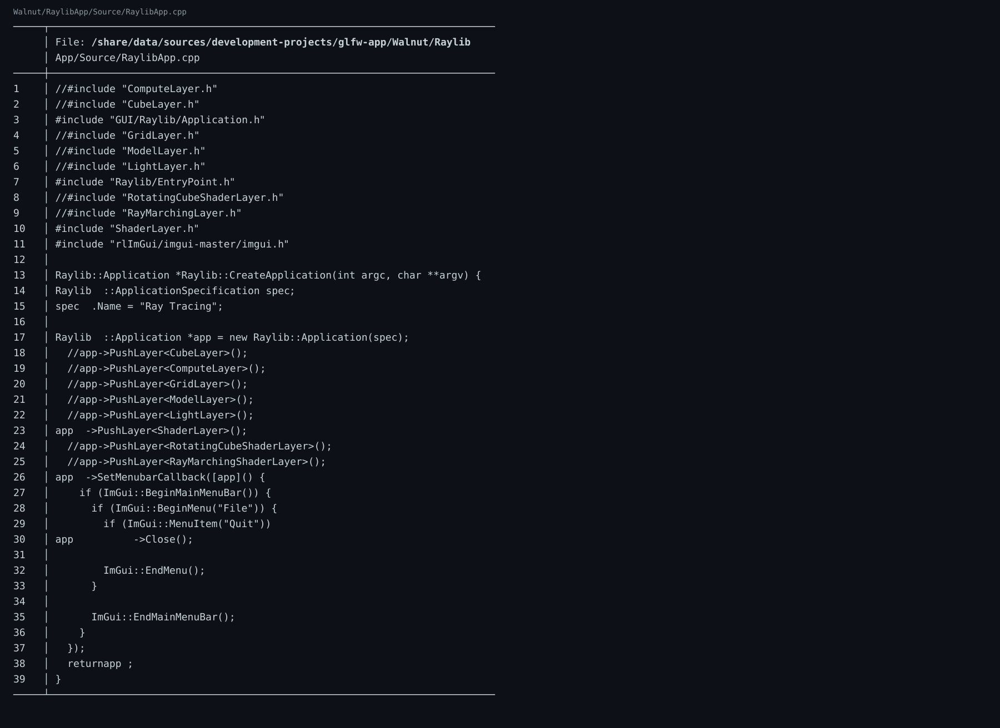

🔗 仓库链接：https://github.com/linuxing3/Cubed

# 背景情况
我一开始以为是“纯 OpenGL 项目”，结果翻提交发现：早期有 `Vulkan.cpp/h`，后来删掉并换成更轻量路线。

```bash
git show --name-status daf5bd5
```
重点：
```text
D Cubed-Client/Source/Renderer/Vulkan.cpp
D Cubed-Client/Source/Renderer/Vulkan.h
```

# 基本目标
搞清楚三件事：
1. Vulkan 为什么被移除（至少在该阶段）。
2. OpenGL + Walnut/ImGui 如何接管显示路径。
3. Raylib/rlImGui 为什么被引入（易用性、开发效率）。

# 实现过程
## 1) 删除旧后端包袱
`daf5bd5` 把 Vulkan 文件移除，意味着开发重心转向更容易迭代的 OpenGL 管线。

## 2) 引入 Raylib + rlImGui
`7e13ae2` 增加：
```text
A Walnut/Walnut/Platform/GUI/Raylib/Application.cpp
A Walnut/RaylibApp/Source/RaylibApp.cpp
```
这一步把“窗口/事件循环/GUI 对接”标准化了。

## 3) 在 raylib 路线上加图像能力
`01fe078 feat: raylib image` 继续补全图像与计算渲染的整合。

# 注意事项
- 不要把“删 Vulkan”理解成 Vulkan 不好；这是阶段性工程选择。
- 对个人或小团队，先跑通再优化往往更实际。

# 踩过的坑
- 我最初按“后端单线程演进”理解，后来发现其实是“多路线并存 + 重构收敛”。

# 代码截图建议
- `git show --name-status daf5bd5` 截图
- `git show --name-status 7e13ae2` 截图
- Raylib Application.cpp 关键初始化片段截图

## 关键代码截图

!02-bat-code

---
## 系列导航
当前进度：**第 2/10 篇**

上一篇：第01篇 Cubed 光线追踪游戏开发实战（01）：开坑总览——我为什么要折腾这个项目

下一篇：第03篇 Cubed 光线追踪游戏开发实战（03）：Walnut 的 Image.cpp 是怎么和 GPU 打交道的

完整系列目录：
- 第01篇：Cubed 光线追踪游戏开发实战（01）：开坑总览——我为什么要折腾这个项目
- 第02篇（当前）：Cubed 光线追踪游戏开发实战（01）：开坑总览——我为什么要折腾这个项目
- 第03篇：Cubed 光线追踪游戏开发实战（01）：开坑总览——我为什么要折腾这个项目
- 第04篇：Cubed 光线追踪游戏开发实战（01）：开坑总览——我为什么要折腾这个项目
- 第05篇：Cubed 光线追踪游戏开发实战（01）：开坑总览——我为什么要折腾这个项目
- 第06篇：Cubed 光线追踪游戏开发实战（02）：从 Vulkan 痕迹到 OpenGL/Raylib 可跑配置
- 第07篇：Cubed 光线追踪游戏开发实战（03）：Walnut 的 Image.cpp 是怎么和 GPU 打交道的
- 第08篇：Cubed 光线追踪游戏开发实战（04）：Application.cpp 里 GPU 启动是怎么设计出来的
- 第09篇：Cubed 光线追踪游戏开发实战（05）：image 如何渲染到 Walnut 的 ImGui 图层
- 第10篇：Cubed 光线追踪游戏开发实战（06）：用 OpenGL 基础框架做出 3D 风格画面
- 第11篇：Cubed 光线追踪游戏开发实战（07）：多启动服务器与客户端通信是怎么串起来的
- 第12篇：Cubed 光线追踪游戏开发实战（08）：CMake + Premake 双构建与 x86_64/ARM64 适配
- 第13篇：Cubed 光线追踪游戏开发实战（09）：工程化收官——生成日志、定期整理、主题分类与双向链接
- 第14篇：Cubed 光线追踪游戏开发实战（10）：前置知识与环境搭建（补完篇）
---
