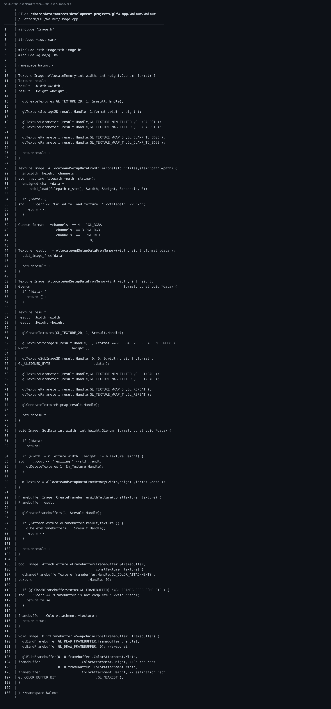

🔗 仓库链接：https://github.com/linuxing3/Cubed

# 背景情况
如果把渲染系统比作厨房，`Image.cpp` 就是“装盘和传菜口”——算完的像素，最后要进屏幕。

# 基本目标
看懂这条最关键链路：
`CPU/计算结果 -> OpenGL Texture -> Framebuffer -> Swapchain(屏幕)`

# 实现过程
核心函数（路径：`Walnut/Walnut/Platform/GUI/Walnut/Image.cpp`）：

```cpp
glCreateTextures(GL_TEXTURE_2D, 1, &result.Handle);
glTextureStorage2D(result.Handle, 1, format, width, height);
glTextureSubImage2D(..., format, GL_UNSIGNED_BYTE, data);
```

再把纹理挂到 FBO：
```cpp
glCreateFramebuffers(1, &result.Handle);
glNamedFramebufferTexture(framebuffer.Handle, GL_COLOR_ATTACHMENT0,
                          texture.Handle, 0);
```

最终 blit 到默认帧缓冲：
```cpp
glBindFramebuffer(GL_READ_FRAMEBUFFER, framebuffer.Handle);
glBindFramebuffer(GL_DRAW_FRAMEBUFFER, 0);
glBlitFramebuffer(..., GL_COLOR_BUFFER_BIT, GL_NEAREST);
```

# 注意事项
- 尺寸变化时会重建纹理（`SetData` 里 delete + re-allocate）。
- 纹理格式要和数据通道一致（RGB/RGBA/RED）。

# 踩过的坑
- FBO 完整性检查很容易写了但忘看返回值，黑屏就来了。
- `glCheckFramebufferStatus` 的调用时机不对，会让你误判“代码没问题”。

# 代码截图建议
- `Image.cpp` 中 `AllocateAndSetupDataFromMemory`
- `CreateFramebufferWithTexture / BlitFramebufferToSwapchain`

## 关键代码截图

!03-bat-code

---
## 系列导航
当前进度：**第 3/10 篇**

上一篇：第02篇 Cubed 光线追踪游戏开发实战（02）：从 Vulkan 痕迹到 OpenGL/Raylib 可跑配置

下一篇：第04篇 Cubed 光线追踪游戏开发实战（04）：Application.cpp 里 GPU 启动是怎么设计出来的

完整系列目录：
- 第01篇：Cubed 光线追踪游戏开发实战（01）：开坑总览——我为什么要折腾这个项目
- 第02篇：Cubed 光线追踪游戏开发实战（01）：开坑总览——我为什么要折腾这个项目
- 第03篇（当前）：Cubed 光线追踪游戏开发实战（01）：开坑总览——我为什么要折腾这个项目
- 第04篇：Cubed 光线追踪游戏开发实战（01）：开坑总览——我为什么要折腾这个项目
- 第05篇：Cubed 光线追踪游戏开发实战（01）：开坑总览——我为什么要折腾这个项目
- 第06篇：Cubed 光线追踪游戏开发实战（02）：从 Vulkan 痕迹到 OpenGL/Raylib 可跑配置
- 第07篇：Cubed 光线追踪游戏开发实战（03）：Walnut 的 Image.cpp 是怎么和 GPU 打交道的
- 第08篇：Cubed 光线追踪游戏开发实战（04）：Application.cpp 里 GPU 启动是怎么设计出来的
- 第09篇：Cubed 光线追踪游戏开发实战（05）：image 如何渲染到 Walnut 的 ImGui 图层
- 第10篇：Cubed 光线追踪游戏开发实战（06）：用 OpenGL 基础框架做出 3D 风格画面
- 第11篇：Cubed 光线追踪游戏开发实战（07）：多启动服务器与客户端通信是怎么串起来的
- 第12篇：Cubed 光线追踪游戏开发实战（08）：CMake + Premake 双构建与 x86_64/ARM64 适配
- 第13篇：Cubed 光线追踪游戏开发实战（09）：工程化收官——生成日志、定期整理、主题分类与双向链接
- 第14篇：Cubed 光线追踪游戏开发实战（10）：前置知识与环境搭建（补完篇）
---
