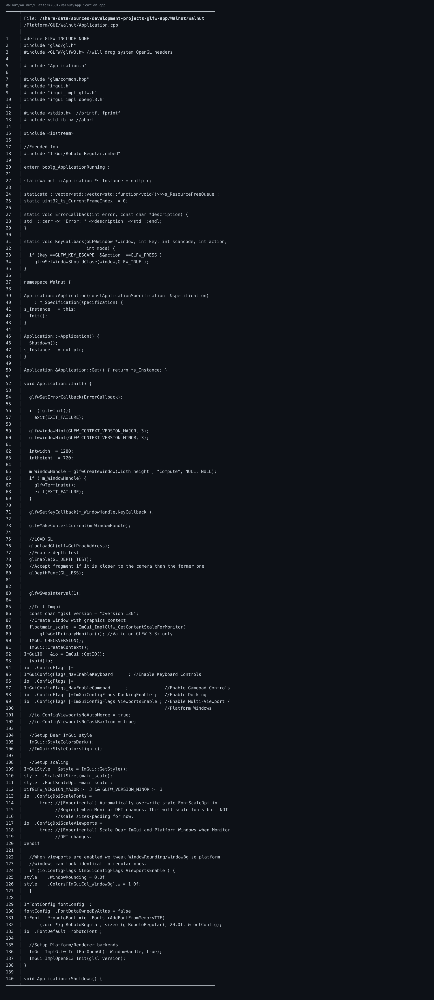

🔗 仓库链接：https://github.com/linuxing3/Cubed

# 背景情况
“项目能运行”这件事，90% 靠 `Application.cpp` 的初始化顺序别写反。

# 基本目标
对照两套启动路径：
- Walnut/OpenGL 路线：GLFW + glad + ImGui_ImplOpenGL3
- Raylib 路线：raylib + rlImGui

# 实现过程
## Walnut/OpenGL 关键启动
```cpp
glfwInit();
glfwCreateWindow(...);
glfwMakeContextCurrent(...);
gladLoadGL(glfwGetProcAddress);
ImGui_ImplGlfw_InitForOpenGL(...);
ImGui_ImplOpenGL3_Init("#version 130");
```

## Raylib 关键启动
```cpp
SetConfigFlags(FLAG_MSAA_4X_HINT | FLAG_VSYNC_HINT | FLAG_WINDOW_RESIZABLE);
InitWindow(...);
rlImGuiSetup(true);
```

## 主循环共性
- 更新时间步
- 更新 Layer
- 绘制 UI
- Present

# 注意事项
- 初始化顺序错一个，后面全是玄学报错。
- 多 viewport 或 docking 打开后，样式和 DPI 要同步考虑。

# 踩过的坑
- 我曾把 `ImGui::CreateContext()` 放到错误阶段，结果字体和输入表现都怪怪的。

# 代码截图建议
- Walnut Application.cpp 初始化片段
- Raylib Application.cpp run loop 片段

## 关键代码截图

!04-bat-code

---
## 系列导航
当前进度：**第 4/10 篇**

上一篇：第03篇 Cubed 光线追踪游戏开发实战（03）：Walnut 的 Image.cpp 是怎么和 GPU 打交道的

下一篇：第05篇 Cubed 光线追踪游戏开发实战（05）：image 如何渲染到 Walnut 的 ImGui 图层

完整系列目录：
- 第01篇：Cubed 光线追踪游戏开发实战（01）：开坑总览——我为什么要折腾这个项目
- 第02篇：Cubed 光线追踪游戏开发实战（01）：开坑总览——我为什么要折腾这个项目
- 第03篇：Cubed 光线追踪游戏开发实战（01）：开坑总览——我为什么要折腾这个项目
- 第04篇（当前）：Cubed 光线追踪游戏开发实战（01）：开坑总览——我为什么要折腾这个项目
- 第05篇：Cubed 光线追踪游戏开发实战（01）：开坑总览——我为什么要折腾这个项目
- 第06篇：Cubed 光线追踪游戏开发实战（02）：从 Vulkan 痕迹到 OpenGL/Raylib 可跑配置
- 第07篇：Cubed 光线追踪游戏开发实战（03）：Walnut 的 Image.cpp 是怎么和 GPU 打交道的
- 第08篇：Cubed 光线追踪游戏开发实战（04）：Application.cpp 里 GPU 启动是怎么设计出来的
- 第09篇：Cubed 光线追踪游戏开发实战（05）：image 如何渲染到 Walnut 的 ImGui 图层
- 第10篇：Cubed 光线追踪游戏开发实战（06）：用 OpenGL 基础框架做出 3D 风格画面
- 第11篇：Cubed 光线追踪游戏开发实战（07）：多启动服务器与客户端通信是怎么串起来的
- 第12篇：Cubed 光线追踪游戏开发实战（08）：CMake + Premake 双构建与 x86_64/ARM64 适配
- 第13篇：Cubed 光线追踪游戏开发实战（09）：工程化收官——生成日志、定期整理、主题分类与双向链接
- 第14篇：Cubed 光线追踪游戏开发实战（10）：前置知识与环境搭建（补完篇）
---
