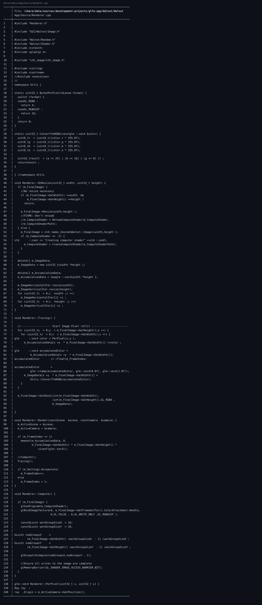

🔗 仓库链接：https://github.com/linuxing3/Cubed

# 背景情况
`f0d4c4f feat: show texture in imgui window` 是一个里程碑：从“算出了图”到“看到了图”。

# 基本目标
回答一个朴素问题：**像素数据如何最终显示在 ImGui 窗口里？**

# 实现过程
1. 渲染/计算阶段生成像素数据。
2. `Image::SetData(...)` 上传到 GPU 纹理。
3. Application 在 UI 帧中渲染 Layer。
4. Layer 里通过 ImGui Image 组件显示纹理句柄。

伪代码流程：
```cpp
renderer.Render();
image.SetData(width, height, GL_RGBA, pixels);
ImGui::Begin("Viewport");
ImGui::Image((ImTextureID)(uintptr_t)image.GetTexture().Handle, size);
ImGui::End();
```

# 注意事项
- ImTextureID 的类型转换要谨慎（不同平台位宽）。
- UI 尺寸变化要和纹理尺寸策略联动，不然拉伸糊图。

# 踩过的坑
- 黑图 ≠ 没渲染，有时只是纹理句柄生命周期错了。

# 代码截图建议
- `f0d4c4f` 变更摘要
- `Image::SetData` + ImGui::Image 调用点

## 关键代码截图

!05-bat-code

---
## 系列导航
当前进度：**第 5/10 篇**

上一篇：第04篇 Cubed 光线追踪游戏开发实战（04）：Application.cpp 里 GPU 启动是怎么设计出来的

下一篇：第06篇 Cubed 光线追踪游戏开发实战（06）：用 OpenGL 基础框架做出 3D 风格画面

完整系列目录：
- 第01篇：Cubed 光线追踪游戏开发实战（01）：开坑总览——我为什么要折腾这个项目
- 第02篇：Cubed 光线追踪游戏开发实战（01）：开坑总览——我为什么要折腾这个项目
- 第03篇：Cubed 光线追踪游戏开发实战（01）：开坑总览——我为什么要折腾这个项目
- 第04篇：Cubed 光线追踪游戏开发实战（01）：开坑总览——我为什么要折腾这个项目
- 第05篇（当前）：Cubed 光线追踪游戏开发实战（01）：开坑总览——我为什么要折腾这个项目
- 第06篇：Cubed 光线追踪游戏开发实战（02）：从 Vulkan 痕迹到 OpenGL/Raylib 可跑配置
- 第07篇：Cubed 光线追踪游戏开发实战（03）：Walnut 的 Image.cpp 是怎么和 GPU 打交道的
- 第08篇：Cubed 光线追踪游戏开发实战（04）：Application.cpp 里 GPU 启动是怎么设计出来的
- 第09篇：Cubed 光线追踪游戏开发实战（05）：image 如何渲染到 Walnut 的 ImGui 图层
- 第10篇：Cubed 光线追踪游戏开发实战（06）：用 OpenGL 基础框架做出 3D 风格画面
- 第11篇：Cubed 光线追踪游戏开发实战（07）：多启动服务器与客户端通信是怎么串起来的
- 第12篇：Cubed 光线追踪游戏开发实战（08）：CMake + Premake 双构建与 x86_64/ARM64 适配
- 第13篇：Cubed 光线追踪游戏开发实战（09）：工程化收官——生成日志、定期整理、主题分类与双向链接
- 第14篇：Cubed 光线追踪游戏开发实战（10）：前置知识与环境搭建（补完篇）
---
