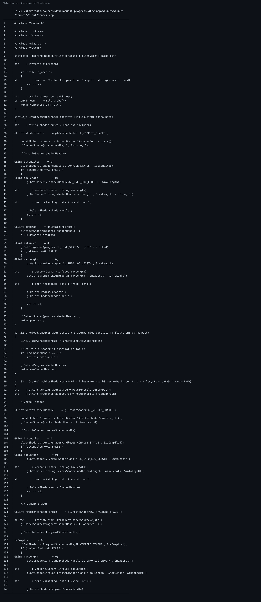

🔗 仓库链接：https://github.com/linuxing3/Cubed

# 背景情况
从提交能看到逐步叠加：`render cube -> grid layer -> shader example -> raymarching`。

# 基本目标
构建“最小 3D 感”闭环：
- 相机/矩阵
- 深度测试
- 基础光照或着色

# 实现过程
关键 OpenGL 设置（Walnut Application.cpp）：
```cpp
glEnable(GL_DEPTH_TEST);
glDepthFunc(GL_LESS);
```

然后在 layer 中更新 MVP、提交 mesh/shader，即可看到立方体和网格有层次感。

# 注意事项
- 没开深度测试，3D 会秒变纸片叠叠乐。
- 时间步不稳定会导致旋转/动画抖动。

# 踩过的坑
- 我第一次调 shader 时，问题不在 shader，在 uniform 没同步更新。

# 代码截图建议
- 深度测试设置片段
- cube/grid layer 渲染调用片段
- shader 目录结构截图

## 关键代码截图

!06-bat-code

---
## 系列导航
当前进度：**第 6/10 篇**

上一篇：第05篇 Cubed 光线追踪游戏开发实战（05）：image 如何渲染到 Walnut 的 ImGui 图层

下一篇：第07篇 Cubed 光线追踪游戏开发实战（07）：多启动服务器与客户端通信是怎么串起来的

完整系列目录：
- 第01篇：Cubed 光线追踪游戏开发实战（01）：开坑总览——我为什么要折腾这个项目
- 第02篇：Cubed 光线追踪游戏开发实战（01）：开坑总览——我为什么要折腾这个项目
- 第03篇：Cubed 光线追踪游戏开发实战（01）：开坑总览——我为什么要折腾这个项目
- 第04篇：Cubed 光线追踪游戏开发实战（01）：开坑总览——我为什么要折腾这个项目
- 第05篇：Cubed 光线追踪游戏开发实战（01）：开坑总览——我为什么要折腾这个项目
- 第06篇（当前）：Cubed 光线追踪游戏开发实战（02）：从 Vulkan 痕迹到 OpenGL/Raylib 可跑配置
- 第07篇：Cubed 光线追踪游戏开发实战（03）：Walnut 的 Image.cpp 是怎么和 GPU 打交道的
- 第08篇：Cubed 光线追踪游戏开发实战（04）：Application.cpp 里 GPU 启动是怎么设计出来的
- 第09篇：Cubed 光线追踪游戏开发实战（05）：image 如何渲染到 Walnut 的 ImGui 图层
- 第10篇：Cubed 光线追踪游戏开发实战（06）：用 OpenGL 基础框架做出 3D 风格画面
- 第11篇：Cubed 光线追踪游戏开发实战（07）：多启动服务器与客户端通信是怎么串起来的
- 第12篇：Cubed 光线追踪游戏开发实战（08）：CMake + Premake 双构建与 x86_64/ARM64 适配
- 第13篇：Cubed 光线追踪游戏开发实战（09）：工程化收官——生成日志、定期整理、主题分类与双向链接
- 第14篇：Cubed 光线追踪游戏开发实战（10）：前置知识与环境搭建（补完篇）
---
