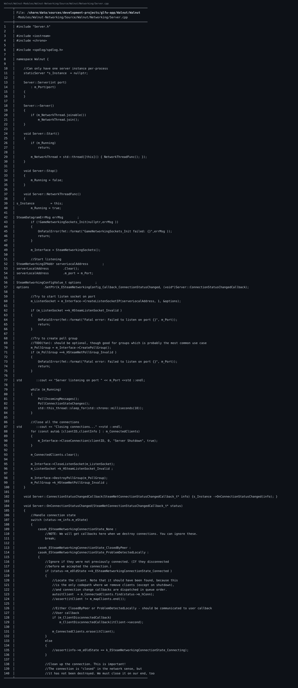

🔗 仓库链接：https://github.com/linuxing3/Cubed

# 背景情况
很多人以为这是纯图形项目，但提交里其实早有网络通信基建。

# 基本目标
讲清：
1. 多实例服务器怎么启动。
2. 客户端和服务端用什么结构通信。

# 实现过程
可见的协议核心在：
```text
Walnut/CubedCommon/Source/ServerPacket.h
Walnut/CubedCommon/Source/ServerPacket.cpp
Walnut/Walnut-Modules/Walnut-Networking/...
```

典型流程：
- 客户端打包请求为 ServerPacket
- 服务端解析并更新状态
- 广播或定向回包

多实例启动思路（示意）：
```bash
./Cubed-Server --port 7001
./Cubed-Server --port 7002
./Cubed-Server --port 7003
```

# 注意事项
- 端口管理、连接超时、状态同步频率是三大稳定性关键。
- 游戏服与渲染线程要注意解耦，别互相阻塞。

# 踩过的坑
- 最难调的不是“发不出去”，而是“发出去了但状态不同步”。

# 代码截图建议
- ServerPacket 结构定义截图
- networking 模块目录结构截图
- 本地多端口启动终端截图

## 关键代码截图

!07-bat-code

---
## 系列导航
当前进度：**第 7/10 篇**

上一篇：第06篇 Cubed 光线追踪游戏开发实战（06）：用 OpenGL 基础框架做出 3D 风格画面

下一篇：第08篇 Cubed 光线追踪游戏开发实战（08）：CMake + Premake 双构建与 x86_64/ARM64 适配

完整系列目录：
- 第01篇：Cubed 光线追踪游戏开发实战（01）：开坑总览——我为什么要折腾这个项目
- 第02篇：Cubed 光线追踪游戏开发实战（01）：开坑总览——我为什么要折腾这个项目
- 第03篇：Cubed 光线追踪游戏开发实战（01）：开坑总览——我为什么要折腾这个项目
- 第04篇：Cubed 光线追踪游戏开发实战（01）：开坑总览——我为什么要折腾这个项目
- 第05篇：Cubed 光线追踪游戏开发实战（01）：开坑总览——我为什么要折腾这个项目
- 第06篇：Cubed 光线追踪游戏开发实战（02）：从 Vulkan 痕迹到 OpenGL/Raylib 可跑配置
- 第07篇（当前）：Cubed 光线追踪游戏开发实战（03）：Walnut 的 Image.cpp 是怎么和 GPU 打交道的
- 第08篇：Cubed 光线追踪游戏开发实战（04）：Application.cpp 里 GPU 启动是怎么设计出来的
- 第09篇：Cubed 光线追踪游戏开发实战（05）：image 如何渲染到 Walnut 的 ImGui 图层
- 第10篇：Cubed 光线追踪游戏开发实战（06）：用 OpenGL 基础框架做出 3D 风格画面
- 第11篇：Cubed 光线追踪游戏开发实战（07）：多启动服务器与客户端通信是怎么串起来的
- 第12篇：Cubed 光线追踪游戏开发实战（08）：CMake + Premake 双构建与 x86_64/ARM64 适配
- 第13篇：Cubed 光线追踪游戏开发实战（09）：工程化收官——生成日志、定期整理、主题分类与双向链接
- 第14篇：Cubed 光线追踪游戏开发实战（10）：前置知识与环境搭建（补完篇）
---
