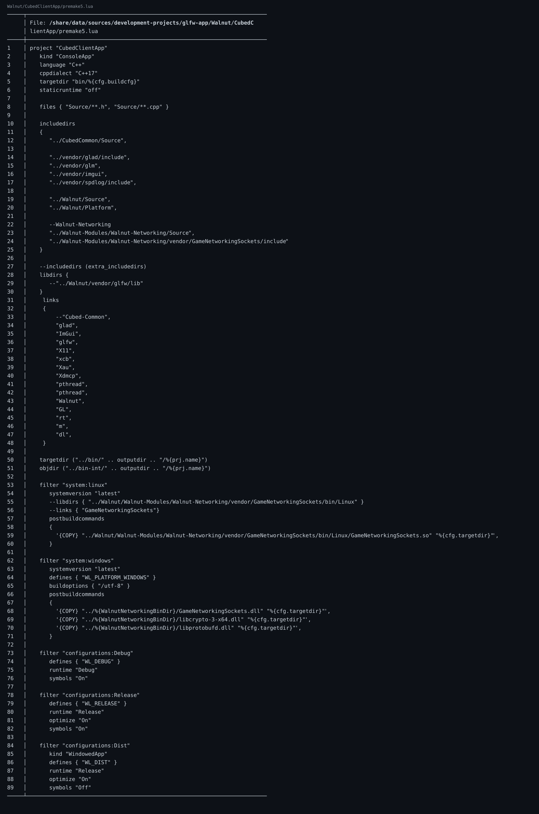

🔗 仓库链接：https://github.com/linuxing3/Cubed

# 背景情况
这个项目不是“一个构建文件打天下”，而是 CMake、Premake、脚本并存。

# 基本目标
让读者知道如何：
- 在不同平台选择合适构建入口
- 在 x86_64 与 ARM64 间切换
- 保持子模块配置一致

# 实现过程
可追踪文件：
```text
CMakeLists.txt
premake5.lua
Walnut/premake5.lua
Walnut/*/*.cmake
```

建议策略：
1. 本地开发先用你最熟的（CMake 或 Premake）。
2. CI 中固定一种主入口，另一种做兼容验证。
3. 架构差异通过 toolchain/宏集中管理。

示意命令：
```bash
cmake -S . -B build -DCMAKE_BUILD_TYPE=Debug
cmake --build build -j

premake5 gmake2
make -j
```

# 注意事项
- 子目录独立 cmake 很方便，也更容易版本漂移。
- ARM64 上第三方库可用性要提前验证。

# 踩过的坑
- “本机能编过”不等于“另一种生成器也能编过”。

# 代码截图建议
- 根目录构建文件列表截图
- 一次 CMake + 一次 Premake 的编译输出截图

## 关键代码截图

!08-bat-code

---
## 系列导航
当前进度：**第 8/10 篇**

上一篇：第07篇 Cubed 光线追踪游戏开发实战（07）：多启动服务器与客户端通信是怎么串起来的

下一篇：第09篇 Cubed 光线追踪游戏开发实战（09）：工程化收官——生成日志、定期整理、主题分类与双向链接

完整系列目录：
- 第01篇：Cubed 光线追踪游戏开发实战（01）：开坑总览——我为什么要折腾这个项目
- 第02篇：Cubed 光线追踪游戏开发实战（01）：开坑总览——我为什么要折腾这个项目
- 第03篇：Cubed 光线追踪游戏开发实战（01）：开坑总览——我为什么要折腾这个项目
- 第04篇：Cubed 光线追踪游戏开发实战（01）：开坑总览——我为什么要折腾这个项目
- 第05篇：Cubed 光线追踪游戏开发实战（01）：开坑总览——我为什么要折腾这个项目
- 第06篇：Cubed 光线追踪游戏开发实战（02）：从 Vulkan 痕迹到 OpenGL/Raylib 可跑配置
- 第07篇：Cubed 光线追踪游戏开发实战（03）：Walnut 的 Image.cpp 是怎么和 GPU 打交道的
- 第08篇（当前）：Cubed 光线追踪游戏开发实战（04）：Application.cpp 里 GPU 启动是怎么设计出来的
- 第09篇：Cubed 光线追踪游戏开发实战（05）：image 如何渲染到 Walnut 的 ImGui 图层
- 第10篇：Cubed 光线追踪游戏开发实战（06）：用 OpenGL 基础框架做出 3D 风格画面
- 第11篇：Cubed 光线追踪游戏开发实战（07）：多启动服务器与客户端通信是怎么串起来的
- 第12篇：Cubed 光线追踪游戏开发实战（08）：CMake + Premake 双构建与 x86_64/ARM64 适配
- 第13篇：Cubed 光线追踪游戏开发实战（09）：工程化收官——生成日志、定期整理、主题分类与双向链接
- 第14篇：Cubed 光线追踪游戏开发实战（10）：前置知识与环境搭建（补完篇）
---
