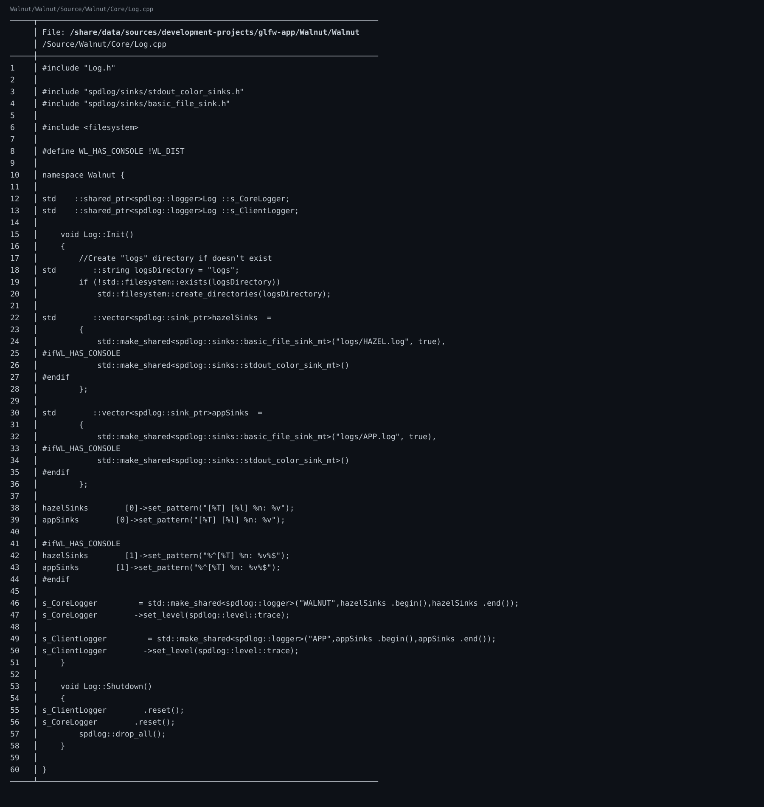

🔗 仓库链接：https://github.com/linuxing3/Cubed

# 背景情况
技术学习最怕“只会当场会，三天后全忘”。所以我把项目知识工程化。

# 基本目标
沉淀一套可复用机制：
- 生成日志（每天/每周）
- 定期整理（增量）
- 主题分类（渲染/网络/构建/架构）
- 双向链接（问题 <-> 提交 <-> 代码）

# 实现过程
建议的数据骨架：
```text
raw/Capture/      # 原始记录
raw/Journal/      # 每日过程
wiki/Rendering/   # 主题整理
wiki/Networking/
wiki/Build/
```

每条知识至少绑定三样东西：
1. 一个 commit
2. 一段代码
3. 一个“为什么这样做”的解释

# 注意事项
- 先记录 raw，再整理 wiki，别反过来。
- 链接比长文更重要：能回溯才算知识资产。

# 踩过的坑
- 我早期只记“结论”，不记“决策过程”，后来复盘时像在猜前任的心思。

# 代码截图建议
- 日志模板截图（含 commit/hash 字段）
- 主题分类目录截图
- 双向链接示例截图（A 文链到 B 文，B 回链 A）

# 系列结语
如果你一路看到这里，恭喜：你已经不只是“会跑 demo”，而是在构建**可持续演进**的图形项目方法论。

## 关键代码截图

!09-bat-code

---
## 系列导航
当前进度：**第 9/10 篇**

上一篇：第08篇 Cubed 光线追踪游戏开发实战（08）：CMake + Premake 双构建与 x86_64/ARM64 适配

下一篇：第10篇 Cubed 光线追踪游戏开发实战（10）：前置知识与环境搭建（补完篇）

完整系列目录：
- 第01篇：Cubed 光线追踪游戏开发实战（01）：开坑总览——我为什么要折腾这个项目
- 第02篇：Cubed 光线追踪游戏开发实战（01）：开坑总览——我为什么要折腾这个项目
- 第03篇：Cubed 光线追踪游戏开发实战（01）：开坑总览——我为什么要折腾这个项目
- 第04篇：Cubed 光线追踪游戏开发实战（01）：开坑总览——我为什么要折腾这个项目
- 第05篇：Cubed 光线追踪游戏开发实战（01）：开坑总览——我为什么要折腾这个项目
- 第06篇：Cubed 光线追踪游戏开发实战（02）：从 Vulkan 痕迹到 OpenGL/Raylib 可跑配置
- 第07篇：Cubed 光线追踪游戏开发实战（03）：Walnut 的 Image.cpp 是怎么和 GPU 打交道的
- 第08篇：Cubed 光线追踪游戏开发实战（04）：Application.cpp 里 GPU 启动是怎么设计出来的
- 第09篇（当前）：Cubed 光线追踪游戏开发实战（05）：image 如何渲染到 Walnut 的 ImGui 图层
- 第10篇：Cubed 光线追踪游戏开发实战（06）：用 OpenGL 基础框架做出 3D 风格画面
- 第11篇：Cubed 光线追踪游戏开发实战（07）：多启动服务器与客户端通信是怎么串起来的
- 第12篇：Cubed 光线追踪游戏开发实战（08）：CMake + Premake 双构建与 x86_64/ARM64 适配
- 第13篇：Cubed 光线追踪游戏开发实战（09）：工程化收官——生成日志、定期整理、主题分类与双向链接
- 第14篇：Cubed 光线追踪游戏开发实战（10）：前置知识与环境搭建（补完篇）
---
