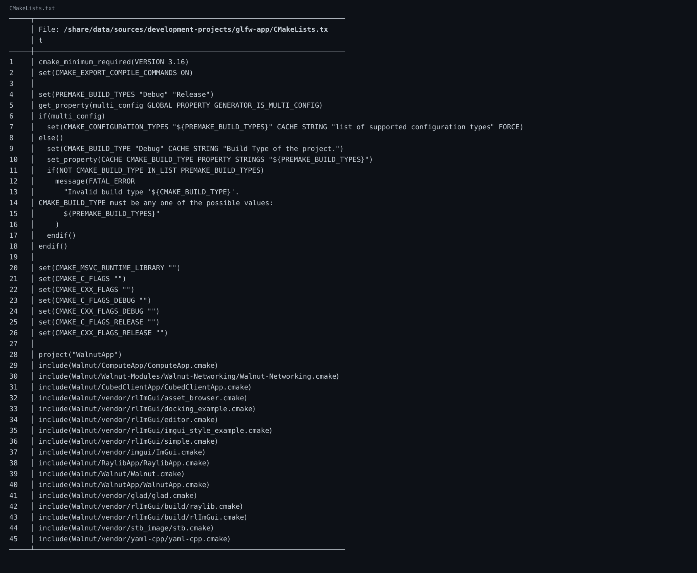

🔗 仓库链接：https://github.com/linuxing3/Cubed

# 背景情况
在这个系列里，我最大的感受是：**环境不稳，学习白给**。所以补一章专门讲“开工前的脚手架”。

# 基本目标
- 一次性确认仓库和分支
- 一次性确认 CMake/Premake 可用
- 一次性确认图形与日志路径可验证

# 实现过程
## 1）确认项目与提交历史
```bash
git -C /share/data/sources/development-projects/glfw-app log --oneline --decorate -n 20
```

## 2）确认核心目录
```bash
find /share/data/sources/development-projects/glfw-app/Walnut -maxdepth 2 -type d | head
```

## 3）确认构建入口
```bash
cd /share/data/sources/development-projects/glfw-app
cmake -S . -B build
premake5 --help
```

## 4）确认 OpenGL + ImGui 路径
重点文件：
- `Walnut/Walnut/Platform/GUI/Walnut/Application.cpp`
- `Walnut/Walnut/Platform/GUI/Walnut/Image.cpp`
- `Walnut/Walnut/Platform/GUI/Raylib/Application.cpp`

# 注意事项
- 先通读提交历史，再读代码；这样知道“为什么会变成现在这样”。
- 先跑最小命令，再跑完整构建。

# 踩过的坑
- 环境变量没带齐时，工具看起来“装了但不能用”。
- 我曾经一头扎进 shader，最后发现是构建入口走错了（经典）。

# 代码截图建议
- git log 截图
- 目录树截图
- cmake/premake 输出截图

# 系列收尾
到这里，10 篇闭环：从动机到架构，从代码到工程化，从单机渲染到多人通信。愿你少踩坑，多出图。

## 关键代码截图

!10-bat-code

---
## 系列导航
当前进度：**第 10/10 篇**

上一篇：第09篇 Cubed 光线追踪游戏开发实战（09）：工程化收官——生成日志、定期整理、主题分类与双向链接

下一篇：无（这是最后一篇）

完整系列目录：
- 第01篇：Cubed 光线追踪游戏开发实战（01）：开坑总览——我为什么要折腾这个项目
- 第02篇：Cubed 光线追踪游戏开发实战（01）：开坑总览——我为什么要折腾这个项目
- 第03篇：Cubed 光线追踪游戏开发实战（01）：开坑总览——我为什么要折腾这个项目
- 第04篇：Cubed 光线追踪游戏开发实战（01）：开坑总览——我为什么要折腾这个项目
- 第05篇：Cubed 光线追踪游戏开发实战（01）：开坑总览——我为什么要折腾这个项目
- 第06篇：Cubed 光线追踪游戏开发实战（02）：从 Vulkan 痕迹到 OpenGL/Raylib 可跑配置
- 第07篇：Cubed 光线追踪游戏开发实战（03）：Walnut 的 Image.cpp 是怎么和 GPU 打交道的
- 第08篇：Cubed 光线追踪游戏开发实战（04）：Application.cpp 里 GPU 启动是怎么设计出来的
- 第09篇：Cubed 光线追踪游戏开发实战（05）：image 如何渲染到 Walnut 的 ImGui 图层
- 第10篇（当前）：Cubed 光线追踪游戏开发实战（06）：用 OpenGL 基础框架做出 3D 风格画面
- 第11篇：Cubed 光线追踪游戏开发实战（07）：多启动服务器与客户端通信是怎么串起来的
- 第12篇：Cubed 光线追踪游戏开发实战（08）：CMake + Premake 双构建与 x86_64/ARM64 适配
- 第13篇：Cubed 光线追踪游戏开发实战（09）：工程化收官——生成日志、定期整理、主题分类与双向链接
- 第14篇：Cubed 光线追踪游戏开发实战（10）：前置知识与环境搭建（补完篇）
---
